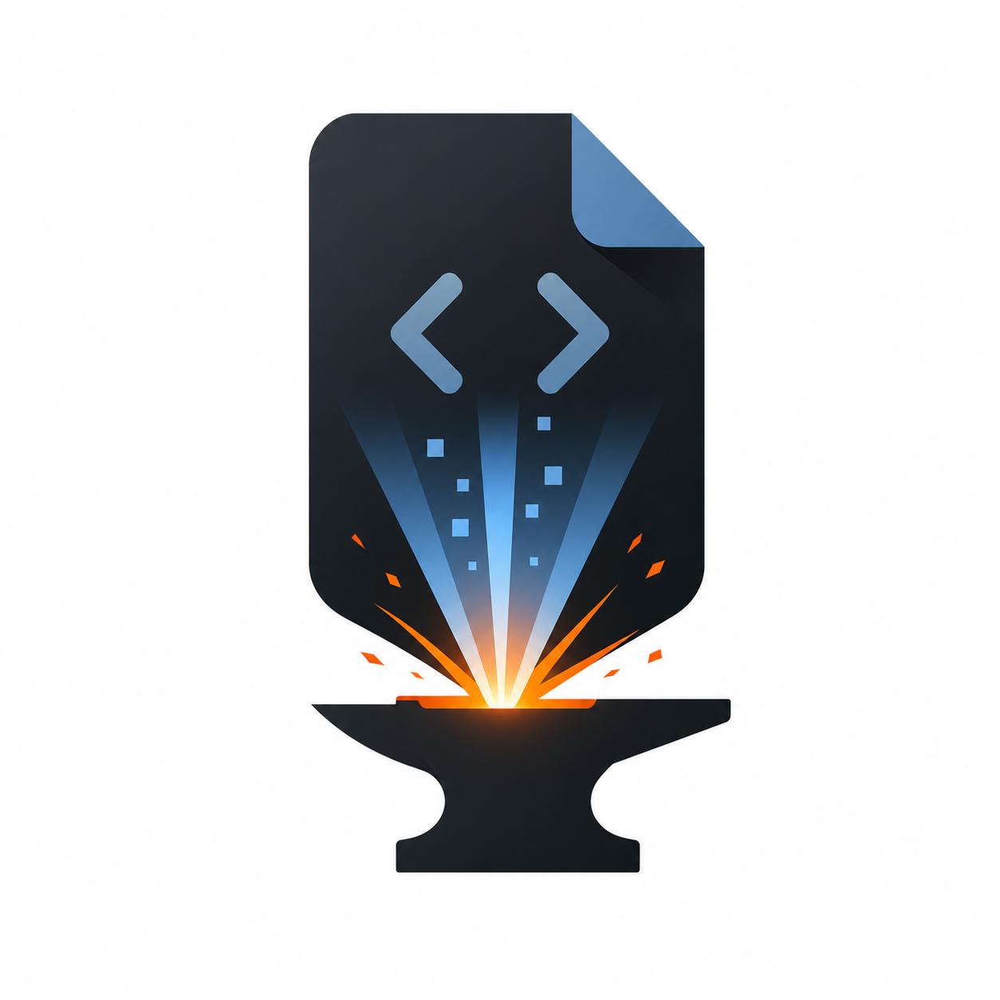

<p align="center">
  
</p>

# Forge

**文档是目标约束。**

Forge 是一个给 AI 开发协作用的决策协议框架。它把文档定义为项目的目标约束——目标是什么、边界在哪、怎么算完成——人类在关键分歧点做选择，AI 记录决策并自主实现。

## 默认适合什么任务

Forge 的默认入口不是完整生命周期，而是**已有项目上的小功能迭代**：

- 你已经知道大概要做什么，只差把决策补完整
- 你希望 AI 先补 detail 目标，再生成实现，再做偏差 review
- 你不想一开始就展开完整能力地图和整套治理机制

如果需求边界还不清，再往前补 `define`。如果只是一个很小的端点或模块改动，可以直接从 `detail` 起步。

## 默认主链

| 场景 | 默认链路 |
|------|----------|
| 需求明确的小功能 | `detail -> codegen -> review` |
| 边界还不清晰的功能 | `define -> detail -> codegen -> review` |

这就是 Forge 的默认心智模型。`plan`、`test`、`deploy`、`research`、`think` 都保留，但属于按需能力，不是首页必修课。

## 默认最小文档集

默认只有三类事实源：

- `docs/project.md`：跨 feature 的共享决策、约束和领域语言
- `docs/features/<feature>/goal.md`：目标、边界、完成标准和 feature 决策
- `docs/change-units/CU-*.md`：每次变更的历史、风险和验证证据

只有 goal 不足以表达模块公共接口或不变量时，才加 `modules/*.md`。

PRD、interaction spec、research brief、testing strategy、deploy plan、DESIGN 和 ADR 都要先通过“独立产物门”：它必须有不同 owner/consumer、更新周期，或独立审批、审计、交接、运维责任。否则结论写回 project/goal/module，过程留在对话或 issue。

默认不创建 changelog、timeline、status、Trace、plan.md、test-cases.md 或 idea brief。

## 怎么开始

### Claude Code 插件安装

在 Claude Code 中运行：

```text
/plugin marketplace add ZeroZ-lab/forge
/plugin install forge@forge
/reload-plugins
```

安装后直接用自然语言描述目标，Forge 会按 skill 描述触发相应协议。

如果只想先判断该走哪条链路，可显式调用 `guide`。它只给出 L0–L3、调用深度和最短链路建议，不执行阶段。

### 默认 prompt

- `用 Forge 为已有 feature 补 detail 目标`
- `按 goal 生成这个 feature 的实现`
- `review 当前修改是否偏离 goal`

插件发布到 Codex / Claude Code 的目录布局和 manifest 约束见 [docs/plugin-publishing.md](docs/plugin-publishing.md)。

## 按需能力

Forge 不是只会 4 步主链，只是默认先从这里开始。下面这些能力都保留，但建议在真的需要时再显式进入：

| 能力 | 什么时候再用 |
|------|--------------|
| `plan` | 任务复杂，需要垂直切片、依赖图或并行矩阵；序列留在对话/issue |
| `test` | 需要协调风险策略、场景和测试代码 |
| `deploy` | 需要明确灰度、回滚、监控和发布清单 |
| `research` | PRD 里出现实时、搜索、推荐、优化、媒体处理等技术信号 |
| `think` | 需要 Socratic / First Principles / Red Team 深挖 |
| `review` | 同类偏差反复出现，要回到方法论层面修正 |

Advanced 入口见 [docs/advanced.md](docs/advanced.md)。

常见场景怎么选流程，见 [docs/usage-scenarios.md](docs/usage-scenarios.md)。

## 开发自检

### 仓库自检

```bash
node scripts/validate.mjs
```

自检会校验版本同步、已发布 skill 与 plugin manifest/registry 完全一致、跨平台显式调用策略、skill 行数与字符预算上限、关键编排顺序、测试用例路径，以及稳定／实验／归档隔离。

### 行为测试

```bash
node --test
```

行为测试验证评测合约和工具脚本的静态完整性，不模拟真实 skill 执行。

### Skill Suite 评测

```bash
node scripts/evaluate-skills.mjs
```

评测自检会校验 `evals/skills-suite/manifest.json`：至少 21 个固定任务、覆盖全部 25 个已发布 skill、fixtures 存在、v2 oracle check 可机器读取，并要求变更型任务提供 Change Unit 和目标验证证据。这只证明评测合约完整，不证明某次 agent 行为有效。

要评价真实运行，把 agent 执行记录整理成 `evals/skills-suite/report.schema.json` 格式，然后运行：

```bash
node scripts/evaluate-skills.mjs --report path/to/report.json
```

加 `--verify-disk` 可让评测额外校验报告里声称的 Change Unit 确实落盘，并要求 CU `Verification` 段里的命令能在同一 run 的 `events.jsonl` 中找到 exit 0 的真实执行记录；仅在 Markdown 中写命令不算验证。

也可以直接用 Codex CLI 跑真实 fixtures：

```bash
node scripts/install-local-codex-plugin.mjs
node scripts/run-skills-benchmark.mjs --case thinking-red-team
node scripts/evaluate-skills.mjs --allow-partial --report .eval-runs/skills-suite/<run-id>/report.json
```

做 Forge vs no-Forge 对照时，用同一 fixture 分别跑完整 Forge prompt 和 no-Forge 最小提示 baseline；no-Forge 模式会剥离 fixture 中的 Forge scoring 指令，只保留产品任务和验收标准：

```bash
node scripts/run-skills-benchmark.mjs --mode forge --case default-chain-small-feature --runs 2 --run-id forge-default-chain
node scripts/run-skills-benchmark.mjs --mode no-forge --case default-chain-small-feature --runs 2 --run-id no-forge-default-chain
node scripts/evaluate-skills.mjs \
  --allow-partial \
  --report .eval-runs/skills-suite/forge-default-chain/report.json \
  --baseline-report .eval-runs/skills-suite/no-forge-default-chain/report.json
```

默认比较门拒绝单 run 对照：每个被比较的 case 至少要有重复样本和不同 `evidence_id`，并要求 Forge 的置信区间下界超过 baseline 上界，同时点估计分数至少达到 no-Forge baseline 的 `2.0x` 且 oracle-derived pass rate 不低于 baseline。该 2.0x 阈值目前仅由历史 2 个选定 n=1 案例校准（guide-shortest-chain、default-chain-small-feature），非 suite 级经验主张；在全 21 case 多 run 实证发布前不应作为能力结论引用。

如果全量运行被 Codex usage limit 中断，可以只评分已完成 case：

```bash
node scripts/evaluate-skills.mjs --skip-blocked --report .eval-runs/skills-suite/<run-id>/report.json
```

## 完整能力地图

默认入口收窄了，但完整框架没有删：

- 全量 skill 和阶段说明：见 [AGENTS.md](AGENTS.md)
- 架构审计：见 [docs/skill-architecture-audit.md](docs/skill-architecture-audit.md)
- Skills Suite 评测：见 [docs/skill-suite-evaluation.md](docs/skill-suite-evaluation.md)

## 8 阶段 × 24 个协议 Skill + 1 个 Guide

这套完整地图仍然保留，只是不再作为默认入口。需要完整阶段矩阵、编排 skill 和治理能力时，直接读 [AGENTS.md](AGENTS.md) 或 [docs/advanced.md](docs/advanced.md)。

## 核心理念

```text
旧认知：代码是源代码，文档是衍生品
Forge：文档是目标约束，代码是实现路径
```

目标约束定义做什么、边界在哪、怎么算完成。实现路径会随技术演进变化，但目标和约束不变。

**代码会腐烂，但决策不会过期。**

## 许可证

MIT
